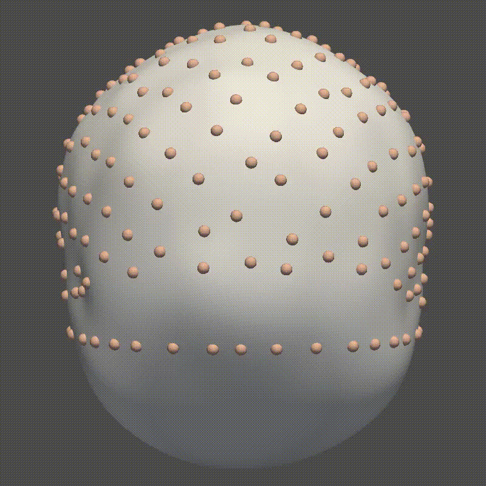

- Scalp Reconstruction from MRI dense point cloud or sparse points collected by the acquisition device


- Scalp's CPC-TBN Frame


- Install:

```shell
pip install -r requirements.txt
conda install -c conda-forge igl, pyvista
```

- Usage: 

```python
from CPCScalpRecons import ScalpReconstruct
V = igl.read_triangle_mesh("./data/12034_CPC.obj")
V, F, cpc, T, N, B = ScalpReconstruct(Vs, nilr, cpc_inners=99)
```
